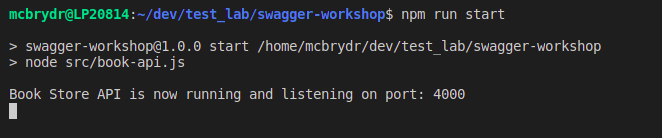

# Swagger UI Workshop

This project contains a "book store" API build with Express and documented using the OpenAPI 2.0 specification. It comes with a built in version of Swagger-UI to allow us to understand and interact with the API.

Follow the *Getting Started* instructions to get both the API and Swagger-UI running locally on your machine then complete the exercises to test the API.

# Getting Started

Clone this repository onto your local machine via:

```bash
git clone git@gitlab.ros.gov.uk:McBrydR/swagger-workshop.git
```

Now change directory into the newly created 'swagger-workshop' folder on your machine:

```bash
cd swagger-workshop
```

Since this is node project, you now need to get all the dependencies by running: 

```bash
npm install
```

Once all of the depenedencies have downloaded start the projet running with via:

```bash
npm run start
```

You should see the following message informing you the app is running locally on port 4000:




Once your app is running open your web browser of choice and navigate to the address `http://localhost:4000/api-docs`. 

You should now see the Swagger-UI running and showing the documentation associated with our Book Store API.

# Exercises

Open the `exercises` folder and work your way through the 3 exercises. Take notes of your findings to discuss with the group. 